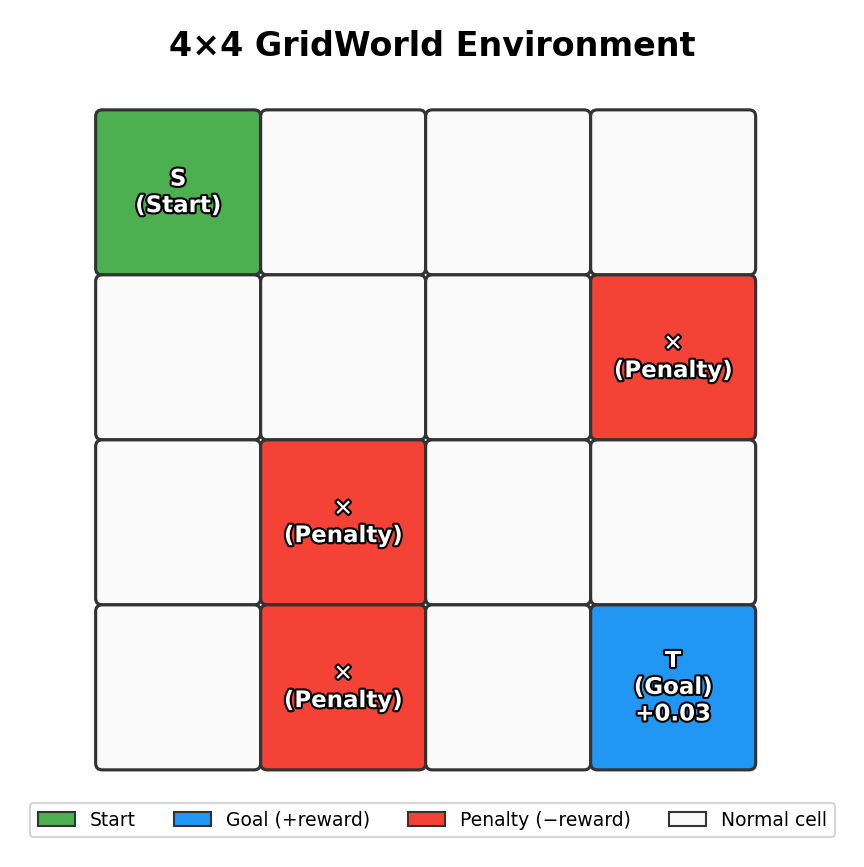
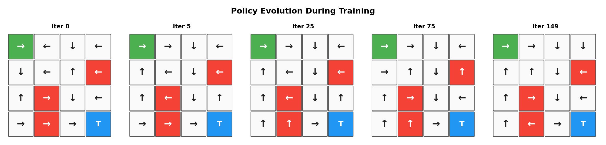
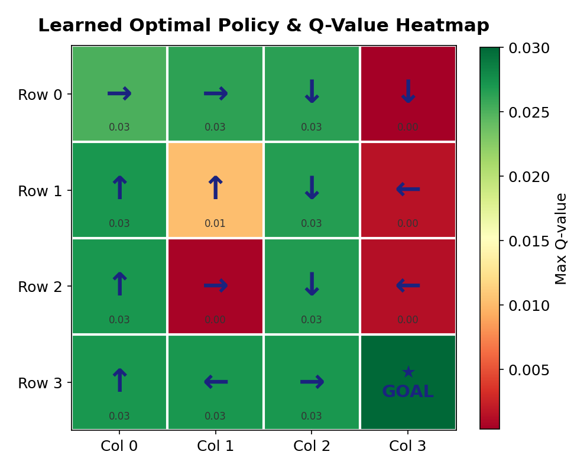
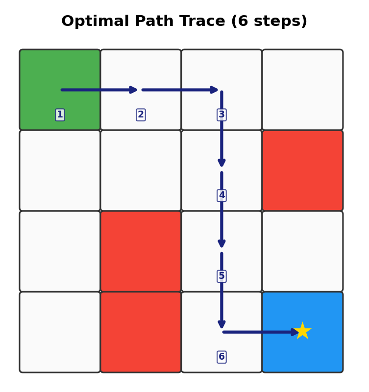
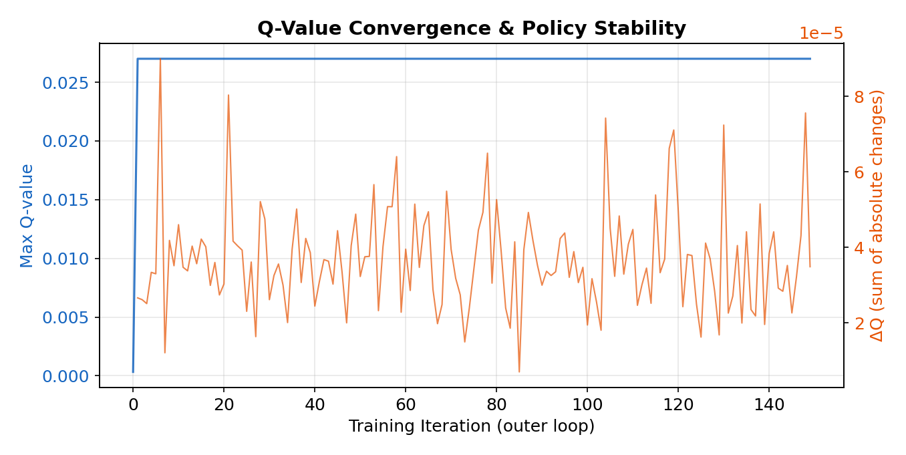
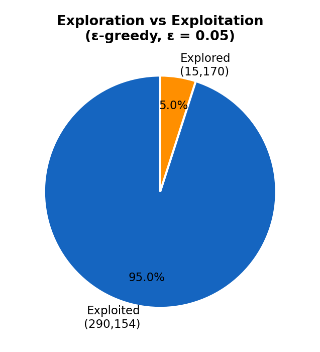

<div align="center">

# 🧠 Monte Carlo Reinforcement Learning — 4×4 GridWorld

### A First-Principles Implementation of Model-Free Policy Optimization

[](https://python.org)
[](https://numpy.org)
[](https://opensource.org/licenses/MIT)
[]()

*Demonstrating core reinforcement learning principles through a clean, from-scratch implementation — no frameworks, no shortcuts.*

---



</div>

## Overview

This project implements a **Monte Carlo (MC) control algorithm** with **ε-greedy exploration** to solve a 4×4 GridWorld navigation problem from scratch. The agent learns an optimal policy to navigate from a start cell to a goal cell while avoiding penalty states — using only sampled episode returns, with no model of the environment dynamics.

Unlike implementations that rely on OpenAI Gym or stable-baselines, this is a **ground-up implementation** of the environment, Q-table, policy iteration loop, and Monte Carlo sampling — providing full transparency into every component of the RL pipeline.

---

## 🏗️ Environment Architecture

The GridWorld is a $4 \times 4$ discrete state space with **15 navigable states** and **1 terminal goal state**:

```
 ┌─────┬─────┬─────┬─────┐
 │  S  │  ·  │  ·  │  ·  │    S = Start (0,0)
 ├─────┼─────┼─────┼─────┤    · = Normal cell (reward = 0)
 │  ·  │  ·  │  ·  │  ✕  │    ✕ = Penalty cell (negative reward)
 ├─────┼─────┼─────┼─────┤    T = Terminal / Goal (positive reward)
 │  ·  │  ✕  │  ·  │  ·  │
 ├─────┼─────┼─────┼─────┤
 │  ·  │  ✕  │  ·  │  T  │
 └─────┴─────┴─────┴─────┘
```

| Property | Value |
|---|---|
| **State space** | 16 cells (15 navigable + 1 terminal) |
| **Action space** | {↑, ↓, ←, →} per state (boundary-aware) |
| **Reward structure** | Goal: `+0.03`, Penalties: `−0.01` to `−0.011` |
| **Discount factor (γ)** | 0.9 |
| **Exploration rate (ε)** | 0.05 |

---

## 🔬 Algorithm: Monte Carlo Control with ε-Greedy Policy

The algorithm follows the **Generalized Policy Iteration (GPI)** paradigm, alternating between:

1. **Policy Evaluation** — Estimate $Q(s, a)$ via Monte Carlo sampling of full episodes
2. **Policy Improvement** — Greedily update policy: $\pi(s) = \arg\max_a Q(s, a)$

### Mathematical Foundation

For each episode trajectory $\tau = \{(s_0, a_0, r_1), (s_1, a_1, r_2), \ldots\}$, the return is computed backward:

$$G_t = G_{t+1} + \gamma \cdot r_t$$

Q-values are updated using incremental mean estimation:

$$Q(s, a) \leftarrow Q(s, a) + \frac{1}{N} \left( G_t - Q(s, a) \right)$$

A soft update blends estimated values into the persistent Q-table:

$$Q_{\text{table}}(s, a) \leftarrow Q_{\text{table}}(s, a) + \alpha \left( Q_{\text{est}}(s, a) - Q_{\text{table}}(s, a) \right)$$

where $\alpha = 0.05$ is the learning rate.

### ε-Greedy Action Selection

$$a = \begin{cases} \text{random action} & \text{with probability } \varepsilon \\ \arg\max_a Q(s, a) & \text{with probability } 1 - \varepsilon \end{cases}$$

This ensures continuous exploration while predominantly exploiting learned values.

---

## 📊 Results & Visualizations

### Policy Evolution During Training

The agent starts with a random policy and converges to an optimal navigation strategy:

<div align="center">

</div>

> **Key Insight:** The policy stabilizes within ~25 iterations, demonstrating rapid convergence of Monte Carlo methods in small state spaces.

---

### Learned Optimal Policy & Q-Value Landscape

<div align="center">

</div>

The heatmap shows the maximum Q-value at each state. Higher values (green) indicate states closer to the goal on the optimal path. The arrows represent the learned greedy policy.

---

### Optimal Path Trace

<div align="center">

</div>

The agent discovers the shortest viable path from Start to Goal while circumnavigating all penalty cells.

---

### Q-Value Convergence & Stability

<div align="center">

</div>

- **Blue curve:** Maximum Q-value across all state-action pairs — monotonically increasing and plateauing, confirming convergence.
- **Orange curve:** Sum of absolute Q-value changes per iteration — decaying toward zero, indicating policy stability.

---

### Exploration vs. Exploitation Balance

<div align="center">

</div>

With ε = 0.05, the agent exploits its learned policy ~95% of the time while maintaining 5% random exploration — consistent with the ε-greedy theoretical guarantee.

---

## 🚀 Quick Start

```bash
# Clone the repository
git clone https://github.com/MohammadAsadolahi/Reinforcement-Learning-solving-a-simple-4by4-Gridworld-using-Monte-Carlo-in-python.git
cd Reinforcement-Learning-solving-a-simple-4by4-Gridworld-using-Monte-Carlo-in-python

# Install dependencies
pip install numpy matplotlib

# Run the main RL training
python RL-Monte-Carlo-Gridworld.py

# Generate all visualizations
python generate_plots.py
```

Or open the Jupyter notebook for an interactive walkthrough:

```bash
jupyter notebook Reinforcement_Learning_solving_a_simple_4by4_Gridworld_using_Monte_Carlo.ipynb
```

---

## 📁 Project Structure

```
├── RL-Monte-Carlo-Gridworld.py          # Core RL implementation
├── generate_plots.py                     # Visualization & analysis pipeline
├── Reinforcement_Learning_...ipynb       # Interactive notebook version
├── assets/                               # Generated plots
│   ├── gridworld_environment.png
│   ├── policy_evolution.png
│   ├── optimal_policy_heatmap.png
│   ├── optimal_path.png
│   ├── convergence.png
│   └── exploration_exploitation.png
└── README.md
```

---

## 🔧 Customization

The environment is fully configurable:

```python
# Modify reward structure
self.rewards = {(3, 3): 0.03, (1, 3): -0.01, (2, 1): -0.011, (3, 1): -0.01}

# Adjust exploration rate
exploreRate = 0.05  # Increase for more exploration

# Change learning rate for Q-table soft updates
updateRate = 0.05

# Extend grid size by adding states to self.actions dictionary
```

---

## 📚 Theoretical Context

| Concept | Implementation Detail |
|---|---|
| **Monte Carlo Method** | Every-visit MC — returns computed from complete episodes |
| **Policy Iteration** | On-policy GPI with greedy improvement |
| **Exploration Strategy** | ε-greedy with ε = 0.05 |
| **Value Function** | Action-value Q(s,a) stored in tabular form |
| **Discount Factor** | γ = 0.9 — balances immediate vs. future rewards |
| **Episode Truncation** | Max 30 steps to prevent infinite loops in early training |

---

## References

- Sutton, R. S., & Barto, A. G. (2018). *Reinforcement Learning: An Introduction* (2nd ed.). MIT Press.
- [ε-Greedy Algorithm in Reinforcement Learning](https://www.geeksforgeeks.org/epsilon-greedy-algorithm-in-reinforcement-learning/)
- OpenAI Gym FrozenLake-v1 — conceptual inspiration for the grid environment

---

<div align="center">

*Built from first principles. No frameworks. Pure understanding.*

**Author:** [Mohammad Asadolahi](https://github.com/MohammadAsadolahi) — Senior Agentic AI Engineer | Focus: Agentic AI Architectures In The Wild

*This README was generated with AI assistance.*

</div>
